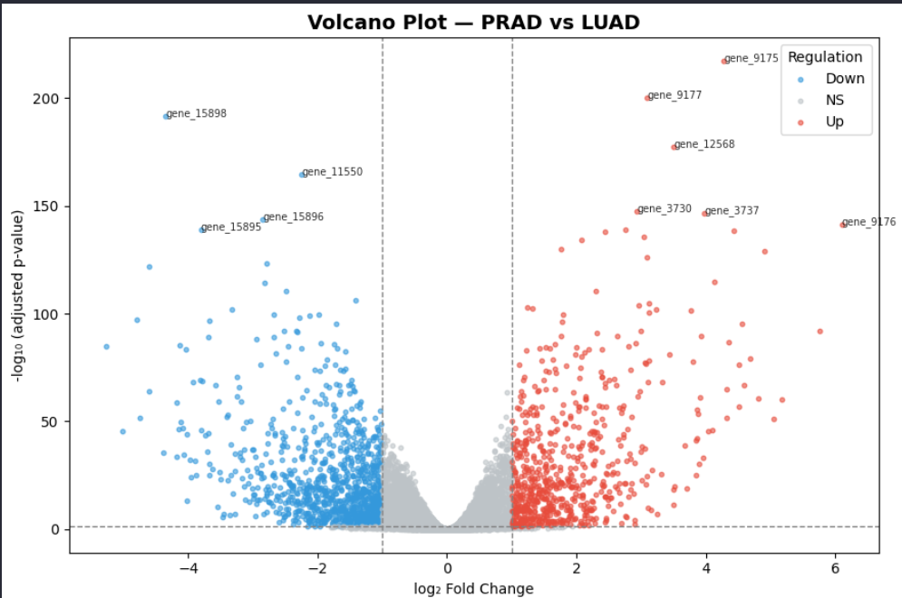
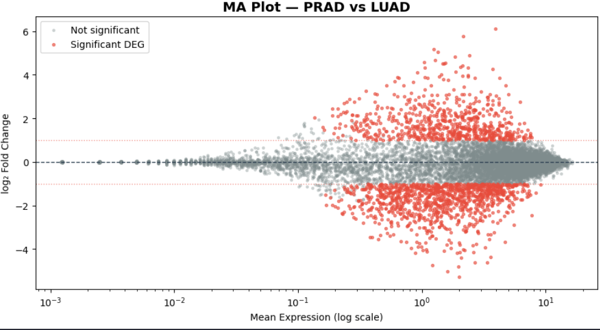
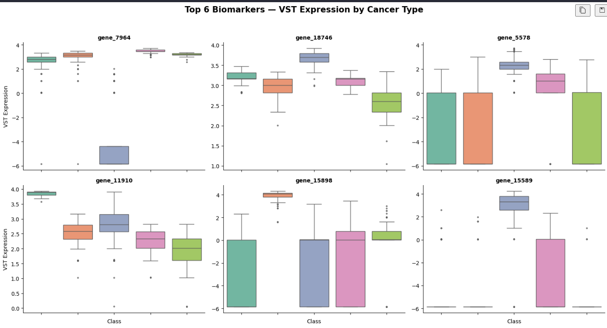

# Cancer Type Classification & Biomarker Discovery
## Integrated DESeq2 + Machine Learning Pipeline

**Author:** Xhovalin Panagiotis Qaazimi  
**Dataset:** TCGA Multi-Cancer RNA-seq

## 📋 Project Overview
This project presents an end-to-end bioinformatics pipeline designed to identify statistically significant gene biomarkers and classify various cancer types using interpretable Machine Learning models. 

The analysis is based on transcriptomic data from **The Cancer Genome Atlas (TCGA)** and combines rigorous statistical differential expression analysis (DESeq2) with high-performance classifiers and Explainable AI (SHAP) techniques.

---

## 📊 Dataset Information
The dataset used in this analysis is sourced from **The Cancer Genome Atlas (TCGA)**:
* **Data Type:** Transcriptomic RNA-seq (Raw Counts).
* **Content:** Gene expression levels from thousands of patient samples across multiple cancer types (e.g., BRCA, LUAD, PRAD).
* **Metadata:** Includes clinical labels for sample categorization into histological types.
* **Goal:** To identify gene signatures that can accurately distinguish between different histological cancer types based on their molecular profile.

---

## 🛠 Pipeline Architecture
The workflow follows these modular steps:
1. **Raw Counts:** Initial processing of TCGA RNA-seq data.
2. **DESeq2:** Normalization via Variance Stabilizing Transformation (VST) and Differential Expression Analysis.
3. **Biomarker Selection:** Filtering features based on statistical significance (`padj < 0.05`) and effect size (`|Log2 Fold Change| > 1`).
4. **Machine Learning:** Performance comparison of Random Forest (RF), XGBoost, and SVM classifiers.
5. **Explainability:** Utilizing SHAP values to interpret clinical biomarker significance.

---

## 🔬 Methodology & Results

### 1. DESeq2 Statistical Analysis
We used the `pydeseq2` library to identify genes with significant differential expression between cancer cohorts. 
* **Normalization:** VST normalization was applied to stabilize variance across the dynamic range of gene expression, making the data suitable for ML.
* **Selection Criteria:** Genes were flagged as potential biomarkers if they met the `padj < 0.05` and `|LFC| > 1` thresholds.

**Volcano Plot:** Visualizes the distribution of gene significance vs. fold change.


**MA Plot:** Displays the relationship between mean expression and log fold change.


### 2. Machine Learning Model Comparison
Three algorithms were trained on the selected biomarker panel:
* **Random Forest (RF)**
* **Support Vector Machine (SVM)**
* **XGBoost**

Evaluation was performed using **5-Fold Cross-Validation** to ensure robust performance metrics and avoid overfitting.

**Model Performance (Boxplots):**


### 3. Explainable AI with SHAP
To interpret model decisions, **SHAP values** were calculated. These values highlight which specific genes contribute most to the classification of each cancer type.


### 4. Expression Profiles of Top Biomarkers
Visual verification of the top 6 biomarkers (identified via SHAP and DESeq2) showing distinct expression patterns across cancer classes.

**### 5. Exploratory Data Visualization (Dimensionality Reduction)
Before biomarker selection, we performed unsupervised dimensionality reduction to assess sample clustering and data quality. Three distinct approaches were compared:

* **Initial PCA (`pca_initial.jpg`):** This linear transformation visualizes the primary axes of variance in the raw count data. It helps identify natural groupings and potential outliers in the dataset.
* **Log-Transformed PCA (`pca_log.jpg`):** By applying a log transformation before PCA, we normalize the high dynamic range of RNA-seq counts. This emphasizes biological fold-changes over absolute count differences, typically resulting in much clearer separation between cancer types.
* **Sammon Mapping (`sammon_mapping.jpg`):** Unlike PCA, this is a non-linear dimensionality reduction technique that specifically attempts to preserve the relative distances between all pairs of samples. It is highly effective for revealing complex local structures that linear methods might overlook.

**Visual Comparison:**
  **

---

## 📊 Key Findings
* The integrated DESeq2-ML approach identifies biomarkers that are both statistically significant and highly predictive.
* VST normalization is critical for improving classifier performance on RNA-seq count data.
* SHAP analysis confirms biological validity by highlighting genes known to be relevant in specific oncogenic pathways.

---

## 🚀 Installation & Execution
1. Clone the repository.
2. Install dependencies:
   ```bash
   pip install pandas numpy scikit-learn xgboost pydeseq2 shap matplotlib seaborn
